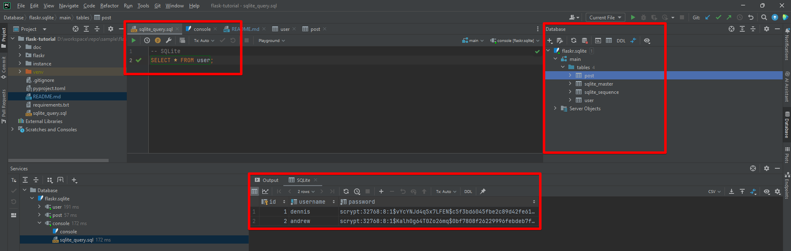
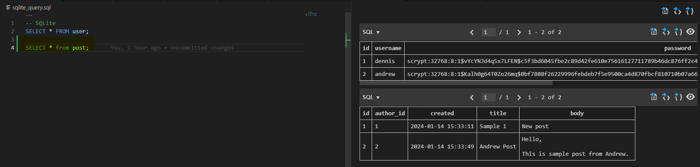

# How to run

## Generate a new virutal environment

```shell
python -m venv venv
```

## Activate the environment

```shell
.\venv\Scripts\activate
```

## Install all libraries in requirements.txt

```shell
pip install -r .\requirements.txt 
```

## Install DB Schema

```shell
flask --app flaskr init-db
```

## Run flask app

```shell
flask --app flaskr run

# Run with debug mode
flask --app flaskr run --debug
# ./instance/flaskr.sqlite is generated
```

# Database

## SQLITE

SQLite is an embedded SQL database engine. Unlike most other SQL databases, SQLite does not have a separate server
process. SQLite reads and writes directly to ordinary `disk files`.

## Tables

Basic database tables are defined in `.\flaskr\schema.sql`

```sql
DROP TABLE IF EXISTS user;
DROP TABLE IF EXISTS post;

CREATE TABLE user
(
    id       INTEGER PRIMARY KEY AUTOINCREMENT,
    username TEXT UNIQUE NOT NULL,
    password TEXT        NOT NULL
);

CREATE TABLE post
(
    id        INTEGER PRIMARY KEY AUTOINCREMENT,
    author_id INTEGER   NOT NULL,
    created   TIMESTAMP NOT NULL DEFAULT CURRENT_TIMESTAMP,
    title     TEXT      NOT NULL,
    body      TEXT      NOT NULL,
    FOREIGN KEY (author_id) REFERENCES user (id)
);
```

### DB Explorer

#### PyCharm Professional

This is the easiest and most intuitive if you have license or student account to use the professional version.

* Just simply open the `sqlite_query.sql`, the IDE would suggest you to choose the `dialect` and configure the Database
  connection.
* When got asked to configure the Database, click on the suggestion and browse to your project
  directory `./instance/flaskr.sqlite`
* Once it is done, you can run your queries and browse all database tables.


#### DBeaver Community Version

#### Visual Studio Code

* Make sure you have `VSC` installed
* The extension can be downloaded and install
  at [SQLITE](https://marketplace.visualstudio.com/items?itemName=alexcvzz.vscode-sqlite)

* `Ctrl+Shift+P`: then type SQLITE Query to open a new query editor
* Open `sqlite_query.sql` and right-click on the query and select run the selected statement.
* A result window will be popped up for viewing.
  

# Project Structure

```shell
│   .gitignore
│   pyproject.toml
│   README.md
│   requirements.txt
│   sqlite_query.sql
│   tree.txt
│
├───flaskr
│   │   auth.py
│   │   blog.py
│   │   db.py
│   │   schema.sql
│   │   __init__.py
│   │
│   ├───static
│   │       style.css
│   │
│   └───templates
│       │   base.html
│       │
│       ├───auth
│       │       login.html
│       │       register.html
│       │
│       └───blog
│               create.html
│               index.html
│               update.html
│
└───instance
        flaskr.sqlite
```